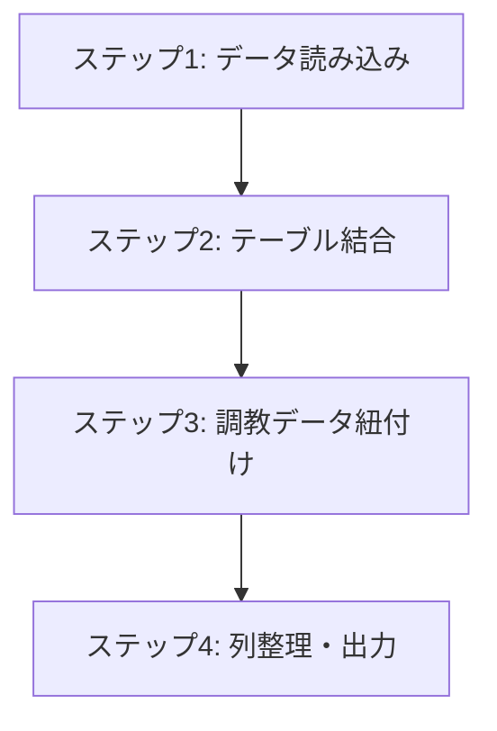
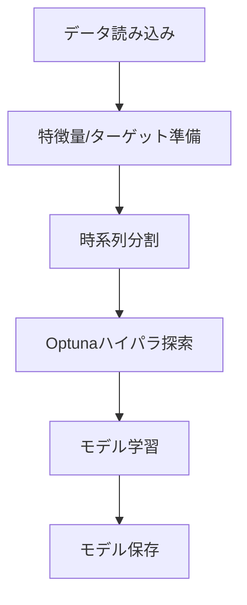

# 競馬予測AIシステム設計書

**バージョン: 1.0**

本文書は、keibaAIプロジェクトの技術仕様と実装詳細を定義するものです。

---

## 目次

1. [プロジェクト概要](#1-プロジェクト概要)
2. [システム構成](#2-システム構成)
3. [使い方](#3-使い方)
4. [実装詳細](#4-実装詳細)
5. [データ仕様](#5-データ仕様)
6. [ポリシー仕様](#6-ポリシー仕様)
7. [ディレクトリ構造](#7-ディレクトリ構造)
8. [開発ガイドライン](#8-開発ガイドライン)

---

## 1. プロジェクト概要

### 1.1. 目的

本プロジェクトは、JRA-VAN公式データベースを使用した競馬予測AIシステムです。

**主な目標:**
- JRA-VAN公式DBの高品質データを活用した予測モデルの構築
- 調教データ（坂路・ウッドチップ）を含む詳細な特徴量の生成
- 複数の賭け戦略（ポリシー）による回収率シミュレーション
- WIN5対象レースの組み合わせ最適化

### 1.2. 対象読者

- プロジェクト開発者
- データサイエンティスト、機械学習エンジニア
- コントリビューター

---

## 2. システム構成

### 2.1. データフロー全体図

```
[JRA-VAN MySQL DB (everydb2)]
         ↓
    preparing.py (データベースエクスポート)
         ↓
[./data/DB/*.parquet] ← n_プレフィックス（過去データ）、s_プレフィックス（当日データ）
         ↓
    preprocessing.py (データ前処理)
         ├─ 学習用モード → ./data/tmp/db_preprocessed_2016_2024.parquet
         └─ 当日予想用モード → ./data/tmp/today_preprocessed_{YYYYMMDD}.parquet
         ↓
    ┌────────────────┴────────────────┐
    ↓                                  ↓
train.py (モデル学習)              predict.py (当日予測)
    ↓                                  ↓
[./models/lightgbm/]              [./predictions/{date}/]
    ↓
test.py (モデル評価・シミュレーション)
    ↓
[./models/{date}/policy_comparison/{task}/]
```

### 2.2. スクリプト一覧

| スクリプト | 役割 | 入力 | 出力 |
|:---|:---|:---|:---|
| **preparing.py** | MySQLからParquetへエクスポート | everydb2 | ./data/DB/*.parquet |
| **preprocessing.py** | データ前処理・特徴量生成 | Parquetファイル | ./data/tmp/*.parquet |
| **train.py** | LightGBMモデル学習 | 前処理済みファイル | ./models/lightgbm/ |
| **test.py** | モデル評価・シミュレーション | 予測結果 | ./models/{date}/ |
| **predict.py** | 当日予測 | 前処理済みファイル | ./predictions/{date}/ |
| **auto_predict.py** | 自動予想・メール送信 | 全自動 | ./predictions_auto/ |

---

## 3. 使い方

### 3.1. 基本的なワークフロー

#### 学習フロー

```powershell
# 1. データエクスポート（GUIツール）
python preparing.py

# 2. 学習用データ前処理
# .envで PREPROCESSING_MODE=train を設定
python preprocessing.py

# 3. モデル学習
python train.py

# 4. モデル評価
python test.py
```

#### 予測フロー

```powershell
# 1. 当日データ前処理
# .envで PREPROCESSING_MODE=today を設定
python preprocessing.py

# 2. 予測実行
python predict.py
```

#### 自動予想フロー

```powershell
# WIN5発走時刻に合わせて自動実行
python auto_predict.py
```

### 3.2. 各スクリプトの詳細

#### 3.2.1. preparing.py

JRA-VAN MySQLデータベースからParquet形式でエクスポートするGUIツール。

**起動方法:**
```powershell
python preparing.py
```

**機能:**
- データベース接続設定（ホスト、ユーザー、パスワード、DB名）
- テーブル一覧表示
  - `n_*`: 過去データ（n_uma_race, n_race, n_uma, n_hanro, n_chip, n_harai, n_jyusyosiki）
  - `s_*`: 当日データ・マスタ（s_uma_race, s_race, s_uma, s_jyusyosiki_head）
- チャンク単位のストリーミングエクスポート
- エクスポート状態管理（`[済]`マーカー表示）

**出力:** `./data/DB/*.parquet`

---

#### 3.2.2. preprocessing.py

複数Parquetファイルを結合し、機械学習用テーブルを生成。

**実行方法:**
```powershell
python preprocessing.py
```

**処理フロー:**


**設定（.env）:**
| 変数名 | 説明 | デフォルト |
|:---|:---|:---|
| `PREPROCESSING_MODE` | 処理モード（train/today/date） | train |
| `PREPROCESSING_TARGET_DATE` | 対象日（YYYYMMDD形式） | 今日の日付 |
| `PREPROCESSING_DB_DIR` | 入力ディレクトリ | data/DB |
| `PREPROCESSING_OUTPUT_DIR` | 出力ディレクトリ | data/tmp |
| `PREPROCESSING_TARGET_YEARS` | 対象年（カンマ区切り） | 2016,...,2024 |
| `PREPROCESSING_TARGET_JYO_CDS` | 対象競馬場コード | 01,...,10 |

**出力:**
- 学習用: `db_preprocessed_2016_2024.parquet`
- 当日用: `today_preprocessed_{YYYYMMDD}.parquet`

---

#### 3.2.3. train.py

LightGBMによるモデル学習を実行。Optunaでハイパーパラメータ最適化。

**実行方法:**
```powershell
python train.py
```

**処理フロー:**


**設定（.env）:**
| 変数名 | 説明 | デフォルト |
|:---|:---|:---|
| `TRAIN_INPUT_FILE` | 入力ファイル | data/tmp/db_preprocessed_2016_2024.parquet |
| `TRAIN_OUTPUT_DIR` | 出力ディレクトリ | models |
| `TRAIN_TASKS` | 学習タスク | win,top3,rank |
| `LGBM_NUM_BOOST_ROUND` | ブースティングラウンド数 | 2000 |
| `LGBM_EARLY_STOPPING_ROUNDS` | 早期停止ラウンド | 200 |
| `LGBM_N_TRIALS` | Optuna試行回数 | 50 |

**タスク定義:**
| タスク | 目的 | 予測対象 |
|:---|:---|:---|
| `win` | 1着予測 | 2値分類（1着 vs その他） |
| `top3` | 3着内予測 | 2値分類（3着以内 vs その他） |
| `rank` | 着順予測 | 多クラス分類（着順1〜18位） |

**出力:**
- `lgbm_{task}.model` - 学習済みモデル
- `best_params_{task}.json` - 最適パラメータ
- `feature_importance_{task}.csv` - 特徴量重要度
- `preds_{task}.parquet` - 検証データ予測結果

---

#### 3.2.4. test.py

モデル評価と賭け戦略シミュレーションを実行。

**実行方法:**
```powershell
python test.py
```

**設定（.env）:**
| 変数名 | 説明 | デフォルト |
|:---|:---|:---|
| `TEST_REGENERATE_PREDS` | 予測再生成フラグ | false |
| `TEST_PREDS_DIR` | 予測ファイルディレクトリ | models/lightgbm |
| `TEST_TASKS` | 評価タスク | win |
| `TEST_OUTPUT_DIR` | 出力ディレクトリ | models |
| `TEST_POLICIES` | 使用ポリシー（all で全ポリシー） | all |
| `TEST_WIN5_ENABLED` | WIN5シミュレーション有効化 | true |
| `TEST_WIN5_THRESHOLD` | WIN5閾値（スイープ可能） | 0.01〜0.10 |

**出力:**
- `policy_comparison_{task}.csv` - ポリシー比較結果
- `{policy}_bet_details.csv` - ポリシー別賭け詳細
- `win5_simulation_results.csv` - WIN5シミュレーション結果

---

#### 3.2.5. predict.py

当日レースの予測とポリシー推奨馬券生成。

**実行方法:**
```powershell
# 事前に preprocessing.py で当日データを準備
python preprocessing.py
python predict.py
```

**設定（.env）:**
| 変数名 | 説明 | デフォルト |
|:---|:---|:---|
| `PREDICT_MODE` | 予測モード（today/date） | today |
| `PREDICT_TARGET_DATE` | 対象日（dateモード時） | 今日の日付 |
| `PREDICT_MODELS_DIR` | モデルディレクトリ | models |
| `PREDICT_PREPROCESSED_DIR` | 前処理済みファイルディレクトリ | data/tmp |
| `PREDICT_OUTPUT_DIR` | 出力ディレクトリ | predictions |
| `PREDICT_TASKS` | 予測タスク | win,top3,rank |
| `PREDICT_POLICIES` | 使用ポリシー | policy_config.jsonから読み込み |
| `PREDICT_WIN5_ENABLED` | WIN5予測有効化 | true |
| `PREDICT_WIN5_THRESHOLD` | WIN5組み合わせ生成用閾値 | 0.06 |
| `PREDICT_WIN5BASE_THRESHOLD` | WIN5Basedポリシー用閾値 | 0.10 |

**WIN5閾値の使い分け:**
| 閾値 | 用途 | 推奨値 |
|:---|:---|:---|
| `PREDICT_WIN5_THRESHOLD` | WIN5対象5レースの組み合わせ生成 | 0.06（低め） |
| `PREDICT_WIN5BASE_THRESHOLD` | WIN5Basedポリシーでの馬券購入判定 | 0.10（高め） |

**出力:**
- `predictions/{date}/prediction_{task}.parquet` - 予測結果
- `predictions/{date}/{task}/policy_recommendations/` - ポリシー別推奨
- `predictions/{date}/win5_recommendations.csv` - WIN5推奨

---

#### 3.2.6. auto_predict.py

WIN5発走時刻に合わせた自動予想・メール送信システム。

**実行方法:**
```powershell
python auto_predict.py
```

**動作フロー:**
1. WIN5対象レースのスケジュール取得
2. 各レース発走前（設定分前）に予測実行
3. 結果をメール送信
4. 未発走レースのみを抽出して送信

**設定（.env）:**
| 変数名 | 説明 | デフォルト |
|:---|:---|:---|
| `AUTO_PREDICT_EMAIL_TO` | 送信先メールアドレス | - |
| `AUTO_PREDICT_EMAIL_FROM` | 送信元メールアドレス | - |
| `AUTO_PREDICT_EMAIL_PASSWORD` | Gmailアプリパスワード | - |
| `AUTO_PREDICT_WIN5_FIRST_RACE_BEFORE` | 最初のレース何分前に出力 | 30 |
| `AUTO_PREDICT_WIN5_OTHER_RACE_BEFORE` | 2回目以降何分前に出力 | 15 |
| `AUTO_PREDICT_TEST_MODE` | テストモード有効化 | false |
| `AUTO_PREDICT_TEST_DATE` | テスト対象日 | 20251228 |
| `AUTO_PREDICT_TEST_TIME` | テスト時刻 | 13:40:00 |

---

## 4. 実装詳細

### 4.1. モジュール構成

```
modules/
├── core/                    # 共通コア機能
│   ├── constants.py         # 定数定義（競馬場コード、カラム順序等）
│   ├── utils.py             # ユーティリティ関数
│   └── __init__.py
├── preparing/               # データエクスポート
│   ├── _config_manager.py   # 設定ファイル管理
│   ├── _database_exporter.py # MySQLエクスポート処理
│   ├── gui/                 # GUIアプリケーション
│   │   ├── main_app.py
│   │   └── tooltip.py
│   └── __init__.py
├── preprocessing/           # データ前処理
│   ├── _data_loader.py      # Parquetファイル読み込み
│   ├── _data_merger.py      # テーブル結合処理
│   ├── _training_processor.py # 調教データ結合
│   ├── _output_handler.py   # 最終整形・出力
│   ├── _win5_processor.py   # WIN5スケジュール処理
│   ├── _config.py           # 前処理設定
│   └── __init__.py
├── training/                # モデル学習
│   ├── _lightgbm_trainer.py # LightGBM学習処理
│   ├── _feature_engineering.py # 特徴量エンジニアリング
│   ├── _hyperparameter_tuning.py # Optunaチューニング
│   └── __init__.py
├── prediction/              # 予測処理
│   ├── _predictor.py        # 予測実行
│   ├── _win5_predictor.py   # WIN5予測
│   ├── _policy_recommender.py # ポリシー推奨生成
│   ├── _result_reporter.py  # 結果レポート生成
│   └── __init__.py
├── evaluation/              # モデル評価
│   ├── _evaluator.py        # 評価メトリクス計算
│   ├── _win5_simulator.py   # WIN5シミュレーション
│   └── __init__.py
└── policies/                # 賭け戦略ポリシー
    ├── _bet_policy.py       # カバレッジ系ポリシー
    ├── _hybrid_bet_policy.py # 期待値系ポリシー
    ├── _race_selective_policy.py # レース選択型ポリシー
    ├── _odds_value_policy.py # オッズ価値ポリシー
    ├── _win5_based_policy.py # WIN5ベースポリシー
    ├── _utils.py            # ポリシーユーティリティ
    └── __init__.py
```

### 4.2. 主要クラス・関数

#### 4.2.1. Win5Processor

WIN5対象レースのスケジュール管理と発走順序の維持。

```python
class Win5Processor:
    """WIN5スケジュール処理"""
    
    def load(self) -> None:
        """過去データ（n_jyusyosiki_head）を読み込み"""
        
    def load_today(self, date_str: str) -> bool:
        """当日データ（s_jyusyosiki_head）を読み込み"""
        
    def get_win5_race_keys(self, date_key: str) -> List[Tuple]:
        """指定日のWIN5対象レースキーリストを取得（発走順序維持）"""
        
    def filter_win5_races(self, df: pd.DataFrame, date_key: str) -> pd.DataFrame:
        """DataFrameをWIN5対象レースのみにフィルタリング"""
```

#### 4.2.2. generate_win5_predictions

WIN5予測の組み合わせ生成。閾値ベースで馬を選択。

```python
def generate_win5_predictions(
    predictions: pd.DataFrame,
    threshold: float = 0.05,
    win5_race_keys: List = None,
) -> Dict[str, Any]:
    """
    WIN5予測を生成
    
    Args:
        predictions: 予測結果DataFrame
        threshold: 選択閾値（この確率以上の馬を選択）
        win5_race_keys: WIN5対象レースキーリスト（発走順序）
    
    Returns:
        Dict: WIN5予測結果（組み合わせ数、各レースの選択馬等）
    """
```

#### 4.2.3. generate_policy_recommendations

ポリシーによる推奨馬券生成。WIN5発走順序を維持。

```python
def generate_policy_recommendations(
    predictions: Dict[str, pd.DataFrame],
    policy_list: List[str],
    primary_task: str = "win",
    win5_race_keys: List = None,
    win5_result: Dict = None,
    win5base_threshold: float = 0.1,
) -> Dict[str, pd.DataFrame]:
    """
    各ポリシーによる推奨馬券を生成
    
    Args:
        predictions: タスクごとの予測結果
        policy_list: ポリシー名リスト
        primary_task: 主タスク
        win5_race_keys: WIN5対象レースキーリスト（発走順序維持）
        win5_result: WIN5予測結果
        win5base_threshold: WIN5Basedポリシー用閾値
    
    Returns:
        Dict: ポリシー名をキーとした推奨馬券DataFrame
    """
```

---

## 5. データ仕様

### 5.1. 入力テーブル

#### 主要テーブル（n_系: 過去データ）

| テーブル | 説明 | 主要カラム |
|:---|:---|:---|
| `n_uma_race` | 出走馬レース情報 | Year, MonthDay, JyoCD, Kaiji, Nichiji, RaceNum, Umaban, KettoNum |
| `n_race` | レース詳細 | RaceName, Kyori, TrackCD, HassoTime |
| `n_uma` | 馬基本情報 | Bamei, BirthDate, SexCD, KehiCD |
| `n_hanro` | 坂路調教 | HanroTime, HanroTimeSec |
| `n_chip` | ウッドチップ調教 | WoodTime, WoodTimeSec |
| `n_harai` | 払戻情報 | PayTansho, PayFukusho, PayUmaren |
| `n_jyusyosiki_head` | WIN5ヘッダ | JyoCD1-5, RaceNum1-5 |
| `n_jyusyosiki` | WIN5本体 | Kumi, PayJyushosiki |

#### 当日テーブル（s_系）

| テーブル | 説明 | 用途 |
|:---|:---|:---|
| `s_uma_race` | 当日出走馬情報 | 当日予測用 |
| `s_race` | 当日レース情報 | 発走時刻取得 |
| `s_uma` | 馬情報（当日更新） | 最新馬情報 |
| `s_jyusyosiki_head` | 当日WIN5ヘッダ | WIN5スケジュール |

### 5.2. レースキー列

レースを一意に識別するための6列：

```python
RACE_KEY_COLS = ["Year", "MonthDay", "JyoCD", "Kaiji", "Nichiji", "RaceNum"]
```

### 5.3. race_id形式

```
{Year}{MonthDay}-{JyoCD}{Kaiji}{Nichiji}-{RaceNum}
例: 20251228-060107-11
```

---

## 6. ポリシー仕様

### 6.1. ポリシー一覧

#### カバレッジ系ポリシー

| ポリシー名 | 説明 | カバレッジ |
|:---|:---|:---|
| `BetPolicyCoverage25` | 上位25%をカバー | 25% |
| `BetPolicyCoverage30` | 上位30%をカバー | 30% |
| `BetPolicyCoverage50` | 上位50%をカバー | 50% |
| `BetPolicyCoverage75` | 上位75%をカバー | 75% |

#### 期待値系ポリシー

| ポリシー名 | 説明 |
|:---|:---|
| `HybridBetPolicy` | 確率とオッズのハイブリッド戦略 |
| `ExpectedValueBetPolicy` | 期待値ベース戦略 |
| `TieredCoverageBetPolicy` | 段階的カバレッジ戦略 |

#### オッズ系ポリシー

| ポリシー名 | 説明 |
|:---|:---|
| `OddsValueTieredPolicy` | オッズと確率の価値ベース段階選択 |
| `OddsBasedExpectedValuePolicy` | オッズベース期待値戦略 |

#### WIN5ベースポリシー

| ポリシー名 | 説明 |
|:---|:---|
| `WIN5BasedMultiPolicy` | WIN5選択馬で全券種購入 |
| `WIN5BasedHedgePolicy` | WIN5リスクヘッジ戦略 |

### 6.2. WIN5BasedMultiPolicy詳細

WIN5対象5レースの選択馬を使用して、全券種の馬券を購入するポリシー。

**選択ロジック:**
1. `win5base_threshold`（デフォルト10%）以上の確率を持つ馬をすべて選択
2. 閾値以上の馬がいない場合、上位1頭をフォールバック選択
3. 選択馬数に応じて購入券種を決定

**購入券種:**
| 選択馬数 | 購入券種 |
|:---|:---|
| 1頭 | 単勝、複勝 |
| 2頭 | 単勝、複勝、馬連、馬単、ワイド、枠連 |
| 3頭以上 | 全券種（三連複、三連単含む） |

**発走順序の維持:**
- `win5_selections`辞書の順序（挿入順）がWIN5の発走順序を表す
- 出力される`detail.txt`もこの順序を維持

### 6.3. OddsValueTieredPolicy詳細

オッズと確率の「価値」を計算し、段階的に馬を選択するポリシー。

**価値計算:**
```python
value = (proba * odds) / (1 + log(odds))
```

**段階選択:**
1. 高価値馬（value >= high_threshold）を優先選択
2. 中価値馬（value >= mid_threshold）を追加選択
3. 低価値馬はオッズ条件（odds >= min_odds）で選択

---

## 7. ディレクトリ構造

```
keibaAI/
├── preparing.py              # データエクスポートGUIツール
├── preprocessing.py          # データ前処理
├── train.py                  # モデル学習
├── test.py                   # モデル評価
├── predict.py                # 当日予測
├── auto_predict.py           # 自動予想システム
├── config.py                 # 設定読み込み
├── tool.py                   # ユーティリティツール
├── .env                      # 環境設定（.gitignore対象）
├── requirements.txt          # 依存パッケージ
├── README.md                 # 使用方法（ユーザー向け）
├── AGENTS.md                 # 設計書（開発者向け）
├── policy_config.json        # ポリシー設定（test.py用）
├── predict_policy_config.json # ポリシー設定（predict.py用）
├── modules/                  # モジュール群
│   ├── core/
│   ├── preparing/
│   ├── preprocessing/
│   ├── training/
│   ├── prediction/
│   ├── evaluation/
│   └── policies/
├── data/                     # データディレクトリ
│   ├── DB/                   # JRA-VAN Parquetファイル
│   └── tmp/                  # 前処理済み中間ファイル
├── models/                   # 学習済みモデル・評価結果
│   └── lightgbm/
├── predictions/              # 予測結果
└── predictions_auto/         # 自動予想結果
```

---

## 8. 開発ガイドライン

### 8.1. コーディング規約

- **言語**: Python 3.10+
- **スタイル**: PEP 8準拠、Black/Ruffでフォーマット
- **型ヒント**: 関数引数・戻り値に型ヒント必須
- **ドキュメント**: Google Styleのdocstring

### 8.2. ドキュメント更新ルール

機能追加・修正時は対応するドキュメントも更新すること：

| 変更内容 | 更新対象 |
|:---|:---|
| 使用方法・コマンド例 | README.md |
| .env設定項目 | README.md, AGENTS.md |
| 実装詳細・モジュール構成 | AGENTS.md |
| ポリシー追加・変更 | AGENTS.md |

### 8.3. コミットメッセージ

```
<type>: <description>

feat: 新機能追加
fix: バグ修正
docs: ドキュメント更新
refactor: リファクタリング
test: テスト追加・修正
chore: その他（依存関係更新等）
```

---

**開発者**: HoodKitSoy  
**リポジトリ**: https://github.com/HoodKitSoy/keibaAI  
**バージョン**: 1.0  
**最終更新**: 2026年1月11日
