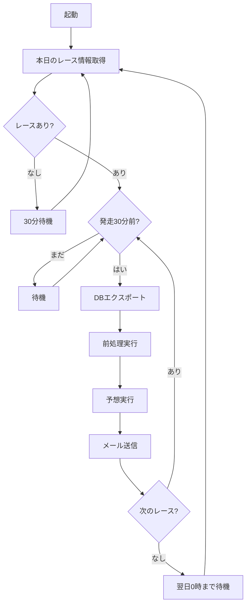

# auto_predict.py 使用ガイド

## 概要

`auto_predict.py`は本日のレース情報を監視し、各レースの30分前に自動で予想を実行してメール送信する自動化システムです。

## セットアップ手順

### 1. Gmailアプリパスワードの取得

1. Googleアカウントにログイン
2. https://myaccount.google.com/security にアクセス
3. 「2段階認証プロセス」を有効化
4. https://myaccount.google.com/apppasswords にアクセス
5. 「アプリを選択」→「その他（カスタム名）」→「競馬AI」等と入力
6. 生成された16文字のパスワードをメモ（スペースなし）

### 2. .env設定

`.env`ファイルに以下を追加・編集：

```dotenv
# [auto_predict.py] 自動予想システム設定
AUTO_PREDICT_EMAIL_TO=yosito72golf@gmail.com
AUTO_PREDICT_EMAIL_FROM=your-email@gmail.com          # あなたのGmailアドレス
AUTO_PREDICT_EMAIL_PASSWORD=abcdabcdabcdabcd          # アプリパスワード（16文字）
AUTO_PREDICT_SMTP_HOST=smtp.gmail.com
AUTO_PREDICT_SMTP_PORT=587
AUTO_PREDICT_DB_EXPORT_INTERVAL=30
```

### 3. 学習済みモデルの準備

以下のファイルが存在することを確認：

```
./models/lightgbm/lgbm_win.model
./models/lightgbm/lgbm_top3.model
./models/lightgbm/lgbm_rank.model
```

存在しない場合は`train.py`で学習を実行：

```powershell
python train.py --tasks win,top3,rank
```

### 4. ポリシー設定

`policy_config.json`で使用するポリシーを設定：

```json
{
  "enabled_policies": [
    "RaceSelectiveHybridPolicy",
    "BetPolicyCoverage25",
    "BetPolicyCoverage50"
  ]
}
```

## 実行方法

```powershell
# 自動予想システムを起動
python auto_predict.py
```

### 実行中の表示例

```
============================================================
競馬AI自動予想システム起動
============================================================
送信先: yosito72golf@gmail.com
DBエクスポート間隔: 30分
============================================================

現在時刻: 2025-12-28 08:00:00
本日のレース: 12 レース
  10:00 - R01 1歳新馬
  10:30 - R02 2歳未勝利
  ...
  
次のレース予想まで 90 分待機 (09:30 に予想実行予定)
```

### 停止方法

`Ctrl+C`を押してプログラムを停止します。

## 動作フロー



## メール内容

送信されるメールには以下が含まれます：

- 予想日時
- 本日のレース一覧（発走時刻、レース番号、レース名）
- 推奨馬券情報の保存先パス
- WIN5予想の保存先パス

## ログファイル

実行ログは以下に保存されます：

```
./logs/auto_predict_20251228.log
```

## トラブルシューティング

### メール送信エラー

**エラー**: `メール設定が不完全です`

**対処**:
1. `.env`に`AUTO_PREDICT_EMAIL_FROM`と`AUTO_PREDICT_EMAIL_PASSWORD`を設定
2. パスワードはGoogleアカウントのパスワードではなく「アプリパスワード」を使用

**エラー**: `Authentication failed`

**対処**:
1. 2段階認証が有効になっているか確認
2. アプリパスワードが正しいか確認（スペースなし16文字）
3. `.env`の設定を再読み込み（プログラム再起動）

### レース情報が見つからない

**エラー**: `本日のレースが見つかりません`

**対処**:
1. `./data/DB/s_race.parquet`が存在するか確認
2. preparing.pyでs_テーブルをエクスポート：
   ```powershell
   # preparing.pyのGUIを起動してs_raceをエクスポート
   python preparing.py
   ```

### 予想処理エラー

**エラー**: `前処理失敗` or `予想失敗`

**対処**:
1. 前処理済みファイルが存在するか確認：
   ```
   ./data/tmp/today_preprocessed_{YYYYMMDD}.parquet
   ```
2. 学習済みモデルが存在するか確認：
   ```
   ./models/lightgbm/lgbm_win.model
   ./models/lightgbm/lgbm_top3.model
   ./models/lightgbm/lgbm_rank.model
   ```
3. 手動で前処理と予想を実行して確認：
   ```powershell
   # .envでPREPROCESSING_MODE=todayを設定して実行
   python preprocessing.py
   
   # .envでPREDICT_MODE=todayを設定して実行
   python predict.py
   ```

## バックグラウンド実行（Windows）

自動予想システムをバックグラウンドで実行する場合：

### 方法1: タスクスケジューラ

1. タスクスケジューラを開く
2. 「基本タスクの作成」
3. トリガー: 毎日 6:00 AM（レース開始前）
4. 操作: プログラムの開始
   - プログラム: `python.exe`のフルパス
   - 引数: `auto_predict.py`
   - 開始: `C:\Users\...\keibaAI`

### 方法2: nssm（Non-Sucking Service Manager）

```powershell
# nssmをダウンロード・インストール
# https://nssm.cc/download

# サービス登録
nssm install KeibaAI "C:\Python310\python.exe" "C:\...\keibaAI\auto_predict.py"
nssm set KeibaAI AppDirectory "C:\...\keibaAI"
nssm start KeibaAI
```

## 注意事項

- **投資は自己責任で**: AIの予想は参考情報です
- **余裕資金の範囲内で**: 生活に影響のない金額で馬券購入してください
- **システムの監視**: 初日は動作を確認し、ログをチェックしてください
- **メール受信確認**: 迷惑メールフォルダに振り分けられていないか確認

## サポート

問題が解決しない場合は、ログファイル（`./logs/auto_predict_{date}.log`）を確認してください。
